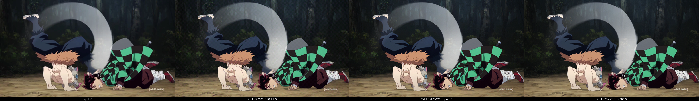
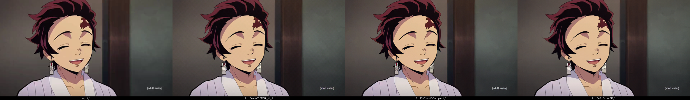
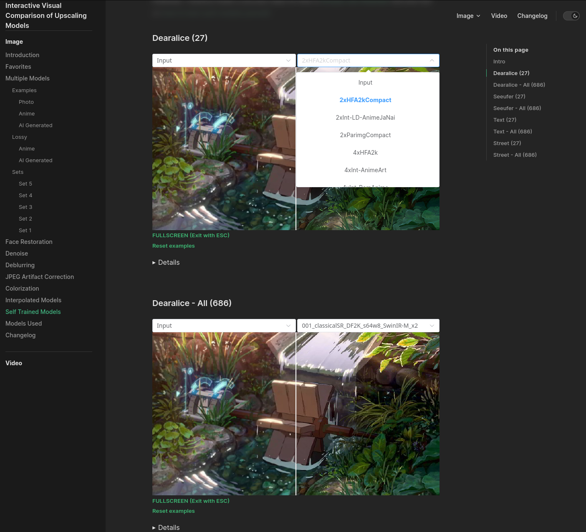
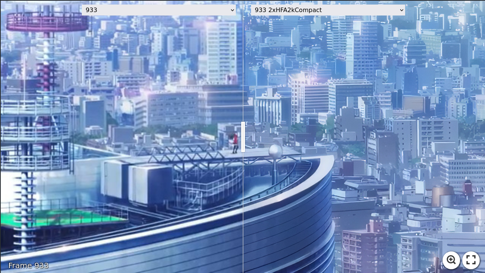

# Models

This is a repo for me to publish my self trained single image super resolution (sisr) models.

Update 08.04.2024:  
I am currently in the process of updating this repo by creating a [github release on this repo](https://github.com/Phhofm/models/releases) for each released model, check out the [Released Section](https://github.com/Phhofm/models?tab=readme-ov-file#released-sorted-by-new) in this partly updated README. Then I can also remove most file folders in this repo.

As an example, you can have a look at my [4xRealWebPhoto_v3_atd release](https://github.com/Phhofm/models/releases/tag/4xRealWebPhoto_v3_atd) which you can try out currently with chaiNNer nightly, or then the [dat2 model version](https://github.com/Phhofm/models/releases/tag/4xRealWebPhoto_v4_dat2) of this with normal chaiNNer.

For convenience, you can download a zip file of all my 111 released models (mostly as safetensors files) [here](https://github.com/Phhofm/models/releases/tag/all_models).

After releasing all models here as github releases, I will also release them on [Hugging Face](https://huggingface.co/Phips) so they are automatically downloadable if used in an application, or used in a huggingface space for example, which i had made two just to showcase, youll find them in the link.

I recommend running these models locally with [chaiNNer](https://github.com/chaiNNer-org/chaiNNer).
I made a [youtube video on how to set up and use chaiNNer](https://youtu.be/_r-nhJ_Cf1k). Btw they externalized their upscaling code into the [Spandrel Library](https://github.com/chaiNNer-org/spandrel)

Results for some of these can be compared on my [interactive visual comparison website](https://phhofm.github.io/upscale/selftrained.html), but this site is currently not up-to-date since it became a 70GB repo so automatic deployment became unfeasible and updating a bit more cumbersome, maybe I will be able in the future to reduce it a bit with [BFG Repo-Cleaner](https://rtyley.github.io/bfg-repo-cleaner/). 

I also made some youtube videos you might find interesting, like [this one](https://www.youtube.com/watch?v=QS4ZF7yzH88).

Find more sisr models trained by the community in [openmodeldb](https://openmodeldb.info/).

Here also a link to the [Enhance Everything! Discord Server](https://discord.gg/enhance-everything-547949405949657098) where I had been active.

Also this weekend I played around with a comfyui workflow using SUPIR, I just uploaded the result in the SUPIR folder. Basically diffusion based upscalers in general have the tendency to produce output that is pretty different to an input image as to resemble more an 'img2img enlarger' process than super resolving. My play around was to try to use the consistency of transformers as the upscale, and then SUPIR in the second step but with settings that enforce consistency. Use case would be for very degraded input image where my transformer model hits a limit. Examples and readme and workflow in the folder.

### Released (sorted by new)  

-- Newly Updated Section --  

[All my 134 released models as safetensors files in a zip file](https://github.com/Phhofm/models/releases/tag/all_models)

Model releases sorted by date, linked to their github release:   
05.09.2024 - [4xNomos2_hq_atd](https://github.com/Phhofm/models/releases/tag/4xNomos2_hq_atd) (A 4x atd upscale model for good quality/non-degraded input)    
29.08.2024 - [4xNomos2_hq_dat2](https://github.com/Phhofm/models/releases/tag/4xNomos2_hq_dat2) (A 4x dat2 upscale model for good quality/non-degraded input)   
25.08.2024 - [4xNomos2_hq_mosr](https://github.com/Phhofm/models/releases/tag/4xNomos2_hq_mosr) (A 4x mosr upscale model for good quality/non-degraded input)     
25.08.2024 - [4xmssim_mosr_pretrain](https://github.com/Phhofm/models/releases/tag/4xmssim_mosr_pretrain) (A 4x mssim only mosr pretrain model at 420k iters for training mosr models)   
16.08.2024 - [4xNomosRealWeb Dataset](https://github.com/Phhofm/models/releases/tag/4xnomosrealweb_dataset) (Degraded x4 LR version with realistic degradations of the Nomosv2 dataset for training 4x upscaling models for upscaling images downloaded from the web).  
16.08.2024 - [SSDIR Dataset](https://github.com/Phhofm/models/releases/tag/ssdir_dataset) (Curated version of the [LSDIR dataset](https://data.vision.ee.ethz.ch/yawli/index.html), for the purpose of training single image super resolution models).  
16.08.2024 - [Lexica Dataset](https://github.com/Phhofm/models/releases/tag/lexica_dataset) (Dataset for the purpose of training single image super resolution models for AI generated images).  
16.08.2024 - [FaceUp Dataset](https://github.com/Phhofm/models/releases/tag/faceup_dataset) (Curated version of the [FFHQ dataset](https://github.com/NVlabs/ffhq-dataset), for the purpose of training single image super resolution models for photographs of faces / portrait photographs).  
13.08.2024 - [4xNature_realplksr_dysample](https://github.com/Phhofm/models/releases/tag/4xNature_realplksr_dysample) (A realplksr dysample model for photographs of nature, based on the released nature dataset)  
13.08.2024 - [Nature Dataset](https://github.com/Phhofm/models/releases/tag/nature_dataset) (Curated version of the [iNaturalist 2017 dataset](https://github.com/visipedia/inat_comp/tree/master/2017), for the purpose of training single image super resolution models.
Consisting of a small version of 3000 images for lightweight networks or a medium version of 7000 images for medium/heavy networks. 512x512px tiles of different Animals and Plants.)   
08.08.2024 - [1xDeH264_realplksr](https://github.com/Phhofm/models/releases/tag/1xDeH264_realplksr) (A 1x realplksr model that removes h264 compression)   
08.08.2024 - [1xDeNoise_realplksr_otf](https://github.com/Phhofm/models/releases/tag/1xDeNoise_realplksr_otf) (A 1x realplksr denoise model, also handles a bit of resizing and jpg compression additionally)   
08.08.2024 - [4xArtFaces_realplksr_dysample](https://github.com/Phhofm/models/releases/tag/4xArtFaces_realplksr_dysample) (4x realplksr dysample upscale model for art / paintings of faces)  
08.08.2024 - [ArtFaces Dataset](https://github.com/Phhofm/models/releases/tag/dataset_artfaces) (Curated version of the [metfaces dataset](https://github.com/NVlabs/metfaces-dataset), for the purpose of training single image super resolution models.
Consisting of 5630 image tiles that are 512x512px of human faces extracted from works of art from the Metropolitan Museum of Art Collection.)  
19.07.2024 - [4xmssim_hma_pretrains](https://github.com/Phhofm/models/releases/tag/4xmssim_hma_pretrains) (4x [hma](https://github.com/korouuuuu/HMA) mssim pretrains since there are no official released models yet)   
13.07.2024 - [4xHFA2k_ludvae_realplksr_dysample](https://github.com/Phhofm/models/releases/tag/4xHFA2k_ludvae_realplksr_dysample) (4x anime single-image super-resolution with degradation handling)   
09.07.2024 - [1xDeJPG_realplksr_otf](https://github.com/Phhofm/models/releases/tag/1xDeJPG_realplksr_otf) (1x dejpg model, trained on otf, jpg down to 40 (and recompressed down to 40))  
30.06.2024 - [4xNomos2_realplksr_dysample](https://github.com/Phhofm/models/releases/tag/4xNomos2_realplksr_dysample) (4x realplksr dysample upscale model, DoF preserving, jpg down to 70)  
27.06.2024 - [4xmssim_realplksr_dysample_pretrain](https://github.com/Phhofm/models/releases/tag/4xmssim_realplksr_dysample_pretrain) (A pretrain to train photo upscaling models for realplksr dysample)  
22.06.2024 - [4xNomos2_otf_esrgan](https://github.com/Phhofm/models/releases/tag/4xNomos2_otf_esrgan) (4x upscale photos, trained with the Real-ESRGAN pipeline on ESRGAN)  
16.06.2024 - [4xNomosWebPhoto_esrgan](https://github.com/Phhofm/models/releases/tag/4xNomosWebPhoto_esrgan) (4x upscale photos downloaded from the web, ESRGAN version)  
07.06.2024 - [4xNomosWebPhoto_atd](https://github.com/Phhofm/models/releases/tag/4xNomosWebPhoto_atd) (4x upscale photos downloaded from the web, ATD model)  
28.05.2024 - [4xNomosWebPhoto_RealPLKSR](https://github.com/Phhofm/models/releases/tag/4xNomosWebPhoto_RealPLKSR) (A rework of my RealWebPhoto series, info on creating the new dataset in the attached pdf. Trained on [RealPLKSR](https://github.com/dslisleedh/PLKSR/issues/4) which is a modified [PLKSR](https://github.com/dslisleedh/PLKSR) and got released 09.05.24 on neosr)   
08.05.2024 - [4xTextures_GTAV_rgt-s_dither](https://github.com/Phhofm/models/releases/tag/4xTextures_GTAV_rgt-s_dither) (An improvement upon the previous model by including dithering in the training dataset)  
04.05.2024 - [4xTextures_GTAV_rgt-s](https://github.com/Phhofm/models/releases/tag/4xTextures_GTAV_rgt-s) (A model to 4x upscale game textures)   
02.05.2024 - [4xRealWebPhoto_v4_drct-l](https://github.com/Phhofm/models/releases/tag/4xRealWebPhoto_v4_drct-l) (A DRCT-L model trained using my previous pretrain, for 4x upscaling photos from the web)   
28.04.2024 - [4xDRCT-mssim-pretrains](https://github.com/Phhofm/models/releases/tag/4xDRCT-mssim-pretrains) (First ever released DRCT pretrains / models to use as pretrain to train more drct models. The first official drct pretrain got released on the 02.06)     
10.04.2024 - [4xpix_span_pretrain & 4xmssim_span_pretrain](https://github.com/Phhofm/models/releases/tag/4xSPAN_pretrains) (Pretrains for SPAN with PixelLoss and one with mssim loss from and for usage with [neosr](https://github.com/muslll/neosr))   
04.04.2024 - [4xRealWebPhoto_v4_dat2](https://github.com/Phhofm/models/releases/tag/4xRealWebPhoto_v4_dat2) 4x upscaling photos downloaded from the web, handles jpg&webp compression, some realistic noise and some lens blur, [DAT2](https://github.com/zhengchen1999/dat) model.   
25.03.2024 - [Ludvae200](https://github.com/Phhofm/models/releases/tag/Ludvae200) 1x realistic noise degradation model for training dataset creation, [LUD-VAE](https://github.com/zhengdharia/LUD-VAE) model.   
22.03.2024 - [4xRealWebPhoto_v3_atd](https://github.com/Phhofm/models/releases/tag/4xRealWebPhoto_v3_atd) 4x upscaling photos downloaded from the web, handles jpg&webp compression, some realistic noise and some lens blur, [ATD](https://github.com/LabShuHangGU/Adaptive-Token-Dictionary) model - recommended to try out ;)   
22.03.2024 - [4xNomos8k_atd_jpg](https://github.com/Phhofm/models/releases/tag/4xNomos8k_atd_jpg) 4x photo upscaler, handles jpg compression, preserves noise, [ATD](https://github.com/LabShuHangGU/Adaptive-Token-Dictionary) model.   
10.03.2024 - [4xRealWebPhoto_v2_rgt_s](https://github.com/Phhofm/models/releases/tag/4xRealWebPhoto_v2_rgt_s) 4x upscaling photos downloaded from the web, handles jpg&webp compression, some realistic noise and some lens blur, [RGT-S](https://github.com/zhengchen1999/RGT) model.   
20.02.2024 - [4xNomosUni_rgt_multijpg](https://github.com/Phhofm/models/releases/tag/4xNomosUni_rgt_multijpg) 4x universal DoF preserving upscaler, handles jpg compression, [RGT](https://github.com/zhengchen1999/RGT) model.   
16.02.2024 - [4xNomosUni_rgt_s_multijpg](https://github.com/Phhofm/models/releases/tag/4xNomosUni_rgt_s_multijpg) 4x universal DoF preserving upscaler, handles jpg compression, [RGT-S](https://github.com/zhengchen1999/RGT) model.   
12.02.2024 - [2xEvangelion_dat2](https://github.com/Phhofm/models/releases/tag/2xEvangelion_dat2) 2x upscaler for the Community Evangelion Ep16 upscale project, [DAT2](https://github.com/zhengchen1999/dat) model.   
08.02.2024 [2xEvangelion_omnisr](https://github.com/Phhofm/models/releases/tag/2xEvangelion_omnisr) 2x upscaler for the Community Evangelion Ep16 upscale project, [OmniSR](https://github.com/Francis0625/Omni-SR) model.   
04.02.2024 - [2xEvangelion_compact](https://github.com/Phhofm/models/releases/tag/2xEvangelion_compact) 2x upscaler for the Community Evangelion Ep16 upscale project, [SRVGGNetCompact](https://github.com/XPixelGroup/BasicSR/blob/master/basicsr/archs/srvgg_arch.py) model.   
28.01.2024 - [4xNomosUniDAT2_multijpg_ldl & 4xNomosUniDAT2_multijpg_ldl_sharp](https://github.com/Phhofm/models/releases/tag/4xNomosUniDAT2_multijpg_ldl) 4x universal DoF preserving upscaler, handles jpg compression, [DAT2](https://github.com/zhengchen1999/dat) models.   
27.01.2024 - [1xExposureCorrection_compact & 1xOverExposureCorrection_compact & 1xUnderExposureCorrection_compact](https://github.com/Phhofm/models/releases/tag/1xExposureCorrection_compact) 1x Exposure correction, [SRVGGNetCompact](https://github.com/XPixelGroup/BasicSR/blob/master/basicsr/archs/srvgg_arch.py) models.   
13.01.2024 - [2xNomosUni_span_multijpg_ldl](https://github.com/Phhofm/models/releases/tag/2xNomosUni_span_multijpg_ldl) 2x fast universal DoF preserving upscaler, handles jpg compression, [SPAN](https://github.com/hongyuanyu/SPAN) model.   
11.01.2024 - [2xNomosUni_compact_multijpg_ldl](https://github.com/Phhofm/models/releases/tag/2xNomosUni_compact_multijpg_ldl)   
11.01.2024 - [2xNomosUni_compact_otf_medium](https://github.com/Phhofm/models/releases/tag/2xNomosUni_compact_otf_medium)   
04.01.2024 - [4xHFA2k_VCISR_GRLGAN_ep200](https://github.com/Phhofm/models/releases/tag/4xHFA2k_VCISR_GRLGAN_ep200)   
04.01.2024 - [2xHFA2kShallowESRGAN](https://github.com/Phhofm/models/releases/tag/2xHFA2kShallowESRGAN)   
26.12.2024 - [2xHFA2kSPAN](https://github.com/Phhofm/models/releases/tag/2xHFA2kSPAN) (2x Anime images/frames, featured and can be used with [SPAN-ncnn-vulkan](https://github.com/TNTwise/SPAN-ncnn-vulkan))   
26.12.2024 - [2xHFA2k_LUDVAE_SPAN](https://github.com/Phhofm/models/releases/tag/2xHFA2k_LUDVAE_SPAN)   
26.12.2024 - [2xHFA2k_LUDVAE_compact](https://github.com/Phhofm/models/releases/tag/2xHFA2k_LUDVAE_compact)   
26.12.2024 - [2xHFA2k_compact_multijpg](https://github.com/Phhofm/models/releases/tag/2xHFA2k_compact_multijpg)   
26.12.2024 - [2xHFA2kReal-CUGAN](https://github.com/Phhofm/models/releases/tag/2xHFA2kReal-CUGAN)   
26.12.2024 - [2xHFA2kOmniSR](https://github.com/Phhofm/models/releases/tag/2xHFA2kOmniSR)   
26.12.2024 - [2xHFA2kSwinIR-S](https://github.com/Phhofm/models/releases/tag/2xHFA2kSwinIR-S)      
20.12.2023 - [2xNomosUni_esrgan_multijpg](https://github.com/Phhofm/models/releases/tag/2xNomosUni_esrgan_multijpg)   
13.12.2023 - [2xNomosUni_span_multijpg](https://github.com/Phhofm/models/releases/tag/2xNomosUni_span_multijpg)   
13.12.2023 - [2xNomosUni_compact_multijpg](https://github.com/Phhofm/models/releases/tag/2xNomosUni_compact_multijpg)   
13.12.2023 - [4xTextureDAT2_otf](https://github.com/Phhofm/models/releases/tag/4xTextureDAT2_otf)   
09.12.2023 - [4xNomosUni_span_multijpg](https://github.com/Phhofm/models/releases/tag/4xNomosUni_span_multijpg)   
09.12.2023 - 4xNomos8k_span_otf_weak & 4xNomos8k_span_otf_medium & 4xNomos8k_span_otf_strong (because of resave training most of these are undertrained)    
01.11.2023 - [4xLexicaDAT2_otf](https://github.com/Phhofm/models/releases/tag/4xLexicaDAT2_otf)   
01.11.2023 - [4xNomos8kHAT-L_otf](https://github.com/Phhofm/models/releases/tag/4xNomos8kHAT-L_otf)   
05.10.2023 - [4xNomos8kHAT-L_bokeh_jpg](https://github.com/Phhofm/models/releases/tag/4xNomos8kHAT-L_bokeh_jpg)   
23.09.2023 - [4xNomosUniDAT_otf](https://github.com/Phhofm/models/releases/tag/4xNomosUniDAT_otf)   
14.09.2023 - [4xNomosUniDAT_bokeh_jpg](https://github.com/Phhofm/models/releases/tag/4xNomosUniDAT_bokeh_jpg)   
10.09.2023 - [4xNomosUniDAT2_box](https://github.com/Phhofm/models/releases/tag/4xNomosUniDAT2_box)   
10.09.2023 - [4xLSDIRDAT](https://github.com/Phhofm/models/releases/tag/4xLSDIRDAT)   
10.09.2023 - [4xReal_SSDIR_DAT_GAN](https://github.com/Phhofm/models/releases/tag/4xReal_SSDIR_DAT_GAN)   
10.09.2023 - [4xSSDIRDAT](https://github.com/Phhofm/models/releases/tag/4xSSDIRDAT)   
02.09.2023 - [4xFaceUpDAT & 4xFaceUpLDAT & 4xFaceUpSharpDAT & 4xFaceUpSharpLDAT](https://github.com/Phhofm/models/releases/tag/4xFaceUpDAT_Series)     
25.08.2023 - [4xFFHQDAT & 4xFFHQLDAT](https://github.com/Phhofm/models/releases/tag/4xFFHQDAT)   
13.08.2023 - [4xNomos8kDAT](https://github.com/Phhofm/models/releases/tag/4xNomos8kDAT)   
02.08.2023 - [1xDeJPG_SRFormer_light & 1xDeJPG_OmniSR & 1xDeJPG_HAT](https://github.com/Phhofm/models/releases/tag/1xDeJPG)   
11.07.2023 - [2xHFA2kAVCSRFormer_light](https://github.com/Phhofm/models/releases/tag/2xHFA2kAVCSRFormer_light)   
30.06.2023 - [4xNomos8kSCHAT-L & 4xNomos8kSCHAT-S](https://github.com/Phhofm/models/releases/tag/4xNomos8kSCHAT)  
26.06.2023 - [4xNomos8kSCSRFormer](https://github.com/Phhofm/models/releases/tag/4xNomos8kSCSRFormer)  
18.06.2023 - [2xHFA2kAVCCompact & 2xHFA2kAVCEDSR_M ](https://github.com/Phhofm/models/releases/tag/2xHFA2kAVCCompact)    
18.06.2023 - [2xHFA2kAVCOmniSR](https://github.com/Phhofm/models/releases/tag/2xHFA2kAVCOmniSR)   
14.06.2023 - [4xHFA2kLUDVAEGRL_small](https://github.com/Phhofm/models/releases/tag/4xHFA2kLUDVAEGRL_small)  
10.06.2023 - [4xHFA2kLUDVAESwinIR_light & 4xHFA2kLUDVAESRFormer_light](https://github.com/Phhofm/models/releases/tag/4xHFA2kLUDVAESwinIR_light%264xHFA2kLUDVAESRFormer_light)   
01.06.2023 - [2xLexicaRRDBNet & 2xLexicaRRDBNet_Sharp](https://github.com/Phhofm/models/releases/tag/2xLexicaRRDBNet)  
10.05.2023 - [4xNomos8kSC](https://github.com/Phhofm/models/releases/tag/4xNomos8kSC)  
07.05.2023 - [4xHFA2k](https://github.com/Phhofm/models/releases/tag/4xHFA2k)  
05.05.2023 - [2xParimgCompact](https://github.com/Phhofm/models/releases/tag/2xParimgCompact)  
18.04.2023 - [2xHFA2kCompact](https://github.com/Phhofm/models/releases/tag/2xHFA2kCompact) (2x Anime images/frames, featured and can be used with [SPAN-ncnn-vulkan](https://github.com/TNTwise/SPAN-ncnn-vulkan))   
11.04.2023 - [4xLSDIRCompactv3 (Series 3)](https://github.com/Phhofm/models/releases/tag/4xLSDIRCompact3)  
25.03.2023 - [4xLSDIRCompact2](https://github.com/Phhofm/models/releases/tag/4xLSDIRCompact2)  
17.03.2023 - [4xLSDIRCompactC & 4xLSDIRCompactR](https://github.com/Phhofm/models/releases/tag/4xLSDIRCompactC)  
11.03.2023 - [4xLSDIRCompact](https://github.com/Phhofm/models/releases/tag/4xLSDIRCompact)  


# Real-ESRGAN Pipeline OTF Settings

I normally try out a lot of things while training, I thought I make a section about one of these things, the Real-ESRGAN pipeline otf settings

While training my first Compact model in the beginning of 2023 (was my new years resolution to try and learn how to train my own sisr model back then), the 4xLSDIRCompact series, it felt to me like the settings used for the otf (on-the-fly) degradations in the Real-ESRGAN pipeline were too strong. 

This can be seen in the [4xLSDIRCompactR](https://github.com/Phhofm/models/releases/tag/4xLSDIRCompactC) model I had released on the 17.03.2023 which used the standard Real-ESRGAN otf values. 
In comparison to the non-degraded model, it lost a lot of details: [https://imgsli.com/MTYyODY3/17/19](https://imgsli.com/MTYyODY3/17/19)    

In the above comparison is also the 4xLSDIRCompactC model outputs, which was my try back then to have a bit more control over jpg compression especially, where I manually degraded the 85'000 training images with jpg compression by degrading 10'000 images with jpg qualiy 100, the next 10'000 with jpg quality 90, and so forth, until 30. Nowadays i would not recommend going that low, and there are dataset destroyer scripts around now who automate that process and are using randomization, but it was my try back then.     
This was simply to show that the standard Real-ESRGAN otf values (as used by Real-ESRGAN, then HAT, and so forth, most official real-world gan trained models using the Real-ESRGAN pipeline used their standard values) are too strong.    

The Real-ESRGAN otf standard values:  
```
# the first degradation process
resize_prob: [0.2, 0.7, 0.1]  # up, down, keep
resize_range: [0.15, 1.5]
gaussian_noise_prob: 0.5
noise_range: [1, 30]
poisson_scale_range: [0.05, 3]
gray_noise_prob: 0.4
jpeg_range: [30, 95]

# the second degradation process
second_blur_prob: 0.8
resize_prob2: [0.3, 0.4, 0.3]  # up, down, keep
resize_range2: [0.3, 1.2]
gaussian_noise_prob2: 0.5
noise_range2: [1, 25]
poisson_scale_range2: [0.05, 2.5]
gray_noise_prob2: 0.4
jpeg_range2: [30, 95]

blur_kernel_size: 21
kernel_list: ['iso', 'aniso', 'generalized_iso', 'generalized_aniso', 'plateau_iso', 'plateau_aniso']
kernel_prob: [0.45, 0.25, 0.12, 0.03, 0.12, 0.03]
sinc_prob: 0.1
blur_sigma: [0.2, 3]
betag_range: [0.5, 4]
betap_range: [1, 2]

blur_kernel_size2: 21
kernel_list2: ['iso', 'aniso', 'generalized_iso', 'generalized_aniso', 'plateau_iso', 'plateau_aniso']
kernel_prob2: [0.45, 0.25, 0.12, 0.03, 0.12, 0.03]
sinc_prob2: 0.1
blur_sigma2: [0.2, 1.5]
betag_range2: [0.5, 4]
betap_range2: [1, 2]
```

After that, on the model I had released on the 18.04.2023, [2xHFA2kCompact](https://github.com/Phhofm/models/releases/tag/2xHFA2kCompact), I used the otf pipeline but without the noise components. Then I tested an ESRGAN model with slightly different settings, [https://imgsli.com/MTczNzA0/1/2](https://imgsli.com/MTczNzA0/1/2) , both trained for 12 hours with gt size 256, batch 10 and x4plus pretrain. The S is with l1_gt_usm:True and percep_gt_usm:True and some otf compression&blur&noise, while the SC is those both set to False and only some otf compression&blur (no noise). I posted it in the community and in general, SC was preferred. This became the released [4xNomos8kSC](https://github.com/Phhofm/models/releases/tag/4xNomos8kSC) model on the 10.05.2023.

Coming back to that in December 2023 when training my [2xNomosUni_compact_multijpg](https://github.com/Phhofm/models/releases/tag/2xNomosUni_compact_multijpg) model, I thought I could takle these otf settings and train 3 different compact models with three different otf settings / strenghts to then test out the outputs these models were to produce and to see which settings I would like best.

Since, like I already stated, the standard Real-ESRGAN otf values were too strong, I weakened the degradations by quite a bit. I called them "strong", "medium" and "weak", and they resulted in the 2xNomosUni_compact_otf_strong, [2xNomosUni_compact_otf_medium](https://github.com/Phhofm/models/releases/tag/2xNomosUni_compact_otf_medium) and 2xNomosUni_compact_otf_weak models. I will show the settings used in the configs here:

2xNomosUni_compact_otf_strong
```
# the first degradation process
resize_prob: [0.3, 0.4, 0.3] # up, down, keep
resize_range: [0.5, 1.5]
gaussian_noise_prob: 0.2
noise_range: [0, 4]
poisson_scale_range: [0.05, 0.5]
gray_noise_prob: 0.1
jpeg_range: [70, 95]

# the second degradation process
second_blur_prob: 0.8
resize_prob2: [0.3, 0.4, 0.3] # up, down, keep
resize_range2: [0.3, 1.5]
gaussian_noise_prob2: 0.2
noise_range2: [0, 4]
poisson_scale_range2: [0.05, 0.25]
gray_noise_prob2: 0.1
jpeg_range2: [60, 95]

blur_kernel_size: 7
kernel_list: ["iso", "aniso", "generalized_iso", "generalized_aniso", "plateau_iso", "plateau_aniso"]
kernel_prob: [0.45, 0.25, 0.12, 0.03, 0.12, 0.03]
sinc_prob: 0.1
blur_sigma: [0.2, 3]
betag_range: [0.5, 4]
betap_range: [1, 2]

blur_kernel_size2: 9
kernel_list2: ["iso", "aniso", "generalized_iso", "generalized_aniso", "plateau_iso", "plateau_aniso"]
kernel_prob2: [0.45, 0.25, 0.12, 0.03, 0.12, 0.03]
sinc_prob2: 0.1
blur_sigma2: [0.2, 1.5]
betag_range2: [0.5, 4]
betap_range2: [1, 2]
```


2xNomosUni_compact_otf_medium
```
# the first degradation process
resize_prob: [0.3, 0.4, 0.3] # up, down, keep
resize_range: [0.5, 1.5]
gaussian_noise_prob: 0.2
noise_range: [0, 2]
poisson_scale_range: [0.05, 0.25]
gray_noise_prob: 0.1
jpeg_range: [40, 95] #lets crack down on jpg compression, after 148k iter, from 75,95 to 40,95

# the second degradation process
second_blur_prob: 0.4
resize_prob2: [0.3, 0.4, 0.3] # up, down, keep
resize_range2: [0.5, 1.5]
gaussian_noise_prob2: 0.2
noise_range2: [0, 2]
poisson_scale_range2: [0.05, 0.1]
gray_noise_prob2: 0.1
jpeg_range2: [40, 95] #jpg compression crackdown, after 148k iter, from 75,95 to 40,95

blur_kernel_size: 7
kernel_list: ["iso", "aniso", "generalized_iso", "generalized_aniso", "plateau_iso", "plateau_aniso"]
kernel_prob: [0.45, 0.25, 0.12, 0.03, 0.12, 0.03]
sinc_prob: 0.1
blur_sigma: [0.2, 3]
betag_range: [0.5, 4]
betap_range: [1, 2]

blur_kernel_size2: 9
kernel_list2: ["iso", "aniso", "generalized_iso", "generalized_aniso", "plateau_iso", "plateau_aniso"]
kernel_prob2: [0.45, 0.25, 0.12, 0.03, 0.12, 0.03]
sinc_prob2: 0.1
blur_sigma2: [0.2, 1.5]
betag_range2: [0.5, 4]
betap_range2: [1, 2]
```

2xNomosUni_compact_otf_weak
```
# the first degradation process
resize_prob: [0.3, 0.4, 0.3] # up, down, keep
resize_range: [0.85, 1.25]
gaussian_noise_prob: 0.2
noise_range: [0, 1]
poisson_scale_range: [0.05, 0.1]
gray_noise_prob: 0.1
jpeg_range: [85, 100]

# the second degradation process
second_blur_prob: 0.2
resize_prob2: [0.3, 0.4, 0.3] # up, down, keep
resize_range2: [0.85, 1.25]
gaussian_noise_prob2: 0.2
noise_range2: [0, 1]
poisson_scale_range2: [0.05, 0.1]
gray_noise_prob2: 0.1
jpeg_range2: [85, 100]

blur_kernel_size: 7
kernel_list: ["iso", "aniso", "generalized_iso", "generalized_aniso", "plateau_iso", "plateau_aniso"]
kernel_prob: [0.45, 0.25, 0.12, 0.03, 0.12, 0.03]
sinc_prob: 0.1
blur_sigma: [0.2, 1.5]
betag_range: [0.5, 2]
betap_range: [1, 2]

blur_kernel_size2: 7
kernel_list2: ["iso", "aniso", "generalized_iso", "generalized_aniso", "plateau_iso", "plateau_aniso"]
kernel_prob2: [0.45, 0.25, 0.12, 0.03, 0.12, 0.03]
sinc_prob2: 0.1
blur_sigma2: [0.2, 1.5]
betag_range2: [0.5, 2]
betap_range2: [1, 2]
```

I can show some visual outputs of these models:  
Degraded:  
  
Noisy:  
  
Face:  
  


I redid the whole training / test by training with the same degradation strengths again, but this time SPAN models.   
I can also show the visual outputs of those:  


Slow Pics Examples SPAN otf series:  
[Face](https://slow.pics/c/oUwjORg3)  
[ani_bokeh](https://slow.pics/c/x55KBHNV)  
[real_degraded](https://slow.pics/c/vAWyo587)  
[noisy](https://slow.pics/c/TYufcfBh)  
[BF4](https://slow.pics/c/gT00liog)  
[Control](https://slow.pics/c/bzE5AX1S)  


These 'medium' settings then became the default values in the current neosr otf default configs.

Something else that I had seen that was also interesting, was when I tried out / trained StarSRGAN in July 23 (but I never officially released any model trained on it), was the used of the Real-ESRGAN otf pipeline but in a manner of defining three different degradation strenght settings and using them in a probabilistic manner:
```
# ----------------- options for synthesizing training data in StarSRGANModel ----------------- #
# USM the ground-truth
l1_gt_usm: True
percep_gt_usm: True
gan_gt_usm: False

degree_list: ['weak_degrade_one_stage', 'standard_degrade_one_stage', 'severe_degrade_two_stage']
degree_prob: [0.3, 0.3, 0.4]

# the degradation process of weak_degrade_one_stage
resize_prob_weak1: [0.1, 0.2, 0.7]  # up, down, keep
resize_range_weak1: [0.85, 1.2]
gaussian_noise_prob_weak1: 0.5
noise_range_weak1: [1, 10]
poisson_scale_range_weak1: [0.05, 0.5]
gray_noise_prob_weak1: 0.4
jpeg_range_weak1: [90, 95]

# the degradation process of standard_degrade_one_stage
resize_prob_standard1: [0.3, 0.4, 0.3]  # up, down, keep
resize_range_standard1: [0.5, 1.2]
gaussian_noise_prob_standard1: 0.5
noise_range_standard1: [1, 20]
poisson_scale_range_standard1: [0.05, 1.5]
gray_noise_prob_standard1: 0.4
jpeg_range_standard1: [50, 95]

# the first degradation process of severe_degrade_two_stage
resize_prob: [0.2, 0.7, 0.1]  # up, down, keep
resize_range: [0.15, 1.5]
gaussian_noise_prob: 0.5
noise_range: [1, 30]
poisson_scale_range: [0.05, 3]
gray_noise_prob: 0.4
jpeg_range: [30, 95]

# the second degradation process of severe_degrade_two_stage
second_blur_prob: 0.8
resize_prob2: [0.3, 0.4, 0.3]  # up, down, keep
resize_range2: [0.3, 1.2]
gaussian_noise_prob2: 0.5
noise_range2: [1, 25]
poisson_scale_range2: [0.05, 2.5]
gray_noise_prob2: 0.4
jpeg_range2: [30, 95]

gt_size: 256
queue_size: 320
```

And then another interesting thing I had seen was the expansion of the Real-ESRGAN otf pipeline with more degradation options, like in this case video compression, which I had used to train my [4xHFA2k_VCISR_GRLGAN_ep200](https://github.com/Phhofm/models/releases/tag/4xHFA2k_VCISR_GRLGAN_ep200) model:
```
if opt['degradation_mode'] == "V2":         
    # Setting for Degradation with Video Compression (V2)

    # V1 Skip setting
    opt['v1_proportion'] = 0.05                     # [~0.05] 
    opt['jpeg_range2'] = [30, 95]                   # V1 JPEG proportion
    
    # Codec
    opt['video_codec'] = ["mpeg2video", "libxvid", "libx264", "libx265"]     # codec
    opt['video_codec_prob'] = [0.2, 0.2, 0.4, 0.2]  

    # CRF
    opt['crf_range'] = [20, 32]                                                                
    opt['crf_offset'] = [0, 0, 0, 5]                            # CRF=23: AVC's default value; CRF=8: HEVC's default value
    opt['mpeg2_4_bitrate_range'] = [3800, 5800]                 

    # Preset
    opt['encode_preset'] = ["slow", "medium", "fast", "faster", "superfast"]         
    opt['encode_preset_prob'] = [0.1, 0.5, 0.25, 0.12, 0.03]                        

    # Auxiliary (Ratio Scaling + FPS)    
    opt['ratio_prob'] = [0.2, 0.4, 0.4]                         # shrink, expand, keep: just width adjust prob
    opt['ratio_range'] = [0.8, 1.35]                            # bottom, ceil 
    opt['fps_range'] = [16, 30]                                 
```
With some visual examples of the model I had trained on it:  


And then, just to show, instead of using Real-ESRGAN otf pipeline, I had made my own manual degradation workflow instead. 

Utilizing my own realistic noise degradation [Ludvae200](https://github.com/Phhofm/models/releases/tag/Ludvae200) model instead of gaussian noise:  


Utilizing the lens blur that umzi implemented for me then in his [wtp_dataset_destroyer](https://github.com/umzi2/wtp_dataset_destroyer):  


This was all applied in the 4xNomosWebPhoto dataset I created which can process can be seen [in this pdf file](https://github.com/Phhofm/models/releases/download/4xNomosWebPhoto_RealPLKSR/4xNomosWebPhoto.pdf). The previous version of this dataset was the 4xRealWebPhoto dataset which went over 4 iterations/reworks, where at the beginning I had used a realistic blur dataset to start, and then switched to adding lens blur, [v4 pdf info](https://github.com/Phhofm/models/releases/download/4xRealWebPhoto_v4_dat2/4xRealWebPhoto_v4.pdf). I also talked about it in the last section of this [youtube video](https://youtu.be/QS4ZF7yzH88?si=hGYK9bkjdLfDGZgL)

# Other Experiments

## Inference Speeds
I also made some other experiments like testing inference speeds of networks:  
With neosr testscript, 50 256x256 images, fastest of 3 runs:  

Compact: 1.90s, 26.35fps  
SPAN: 2.33s, 21.44fps  
SAFMN: 2.92s, 17.11fps  
SeemoRe_t: 4.07s, 12.29fps  
DITN: 4.26s, 11.72fps  
CUGAN: 4.45s, 11.22fps  
PLKSR_tiny: 4.42s, 11.31fps  
MSDAN: 5.30s, 9.43fps  
SeemoRe: 5.54s, 9.02fps  
PLKSR: 8.86s, 5.64fps  
OmniSR: 8.90s, 5.62fps  
Seemore_l: 8.97s, 5.57fps  
SAFMN-L: 9.87s, 5.07fps  
RealPLKSR: 9.90s, 5.05fps  
DCTLSA: 11.53s, 4.43fps  
SwinIR-S: 14.18s, 3.53fps  
SRFormer-light: 16.28s, 3.07fps  
CRAFT: 18.02s, 2.78fps  
ESRGAN: 22.51s, 2.22fps  
DRCT-S: 26.22s,1.91fps  
ATD-Light: 28.51s, 1.75fps  
SwinIR-M: 46.46s, 1.08fps  
DRCT: 58.83s, 0.85fps  
HAT-S: 71.37s, 0.70fps  
RGT_S: 74.83s, 0.67fps  
DAT-S: 74.96s, 0.67fps  
SRFormer-M: 79.02s, 0.63fps  
DAT2: 81.90s, 0.61fps  
HAT-M: 90.19s, 0.55fps  
RGT: 96.07s, 0.52fps  
SwinIR-L: 96.39s, 0.52fps  
DAT: 97.08s, 0.52fps  
DRCT-L: 110.93s, 0.45fps  
ATD: 152.13s, 0.33fps  
HAT-L: 177.75s, 0.28fps  

## Official Pretrains
We can also run the official pretrains of each network that was trained with pixel loss only on the same input. Now doing this oneself meaning training every network option (/ 'arch') with the same settings deterministically would be better, still these have been trained on the same dataset with same losses in a similiar manner and can still give us an impression of the network. For example:  


## Youtube Videos
I basically tried to show and list all my experiments and learnings and findings in [this youtube video](https://www.youtube.com/watch?v=QS4ZF7yzH88)

---
   
# OLD README

Released (sorted by new)  

07.07.23  
**2xHFA2kAVCSRFormer_light**  
A SRFormer light model for upscaling anime videos downloaded from the web, handling AVC (h264) compression.  

06.07.23  
**2xLexicaSwinIR, 4xLexicaHAT, 4xLSDIR, 4xLSDIRplus, 4xLSDIRplusC, 4xLSDIRplusN, 4xLSDIRplusR**  
I upladed my model on [openmodeldb](https://openmodeldb.info/?q=Helaman&sort=date-desc) and therefore 'release' these models, the Lexica models handle no degradations and are for upscaling AI generated outputs further. The LSDIRplus are the official ESRGAN plus model further finetunes with LSDIR, the 4xLSDIRplus is an interpolation of C and R and handles compression and a bit of noise/blur. The 4xLSDIRplusN handles no degradation, the 4xLSDIRplusC handles compression, and 4xLSDIRplusR used the official Real-ESRGAN configs but its only for extremer cases since it destroys details, the 4xLSDIRplusC models should be sufficient for most cases.  

30.06.23  
**4xNomos8kSCHAT-L & 4xNomos8kSCHAT-S**  
My twelfth release, this time a [HAT](https://github.com/XPixelGroup/HAT) large and small model (they uploaded HAT-S codes and models two months ago) - a 4x realistic photo upscaling model handling JPG compression, trained on the [HAT](https://github.com/XPixelGroup/HAT) network (small and large model) with musl's Nomos8k_sfw dataset together with OTF (on the fly degradation) jpg compression and blur.   

26.06.23  
**4xNomos8kSCSRFormer**  
My eleventh release, a 4x realistic photo upscaling model handling JPG compression, trained on the [SRFormer](https://github.com/HVision-NKU/SRFormer) network (base model) with musl's Nomos8k_sfw dataset together with OTF (on the fly degradation) jpg compression and blur.   

18.06.23  
**2xHFA2kAVCOmniSR & 2xHFA2kAVCOmniSR_Sharp**  
My tenth release, a 2x anime upscaling model that handles AVC (h264) compression trained on the [OmniSR](https://github.com/Francis0625/Omni-SR) network (second released community model to use this network, which paper released less than two months ago, on the 24.04.23).  

18.06.23  
**2xHFA2kAVCEDSR_M**  
My ninth release, a fast 2x anime upscaling model that handles AVC (h264) compression trained on the [EDSR](https://github.com/LimBee/NTIRE2017) network (M model).  

18.06.23  
**2xHFA2kAVCCompact**  
Also in my ninth release, a compact 2x anime upscaling model that handles AVC (h264) compression trained on the [SRVGGNet, also called Real-ESRGAN Compact](https://github.com/xinntao/Real-ESRGAN) network.  

14.06.23  
**4xHFA2kLUDVAEGRL_small**  
My eight release - 4x anime upscaling model handling real degradation, trained on the [GRL](https://github.com/ofsoundof/GRL-Image-Restoration) network (small model) with musl's HFA2kLUDVAE dataset.  

10.06.23  
**4xHFA2kLUDAVESwinIR_light**  
My seventh release - 4x anime upscaling model handling real degradation, trained on the [SwinIR](https://github.com/JingyunLiang/SwinIR) network (small model) with musl's HFA2kLUDVAE dataset.   

10.06.23  
**4xHFA2kLUDVAESRFormer_light**  
Also in my seventh release - 4x anime upscaling model handling real degradation, trained on the [SRFormer](https://github.com/HVision-NKU/SRFormer) network (light model) with musl's HFA2kLUDVAE dataset.  

01.06.23  
**2xLexicaRRDBNet & 2xLexicaRRDBNet_Sharp**  
My sixth release - a 2x upscaler for AI generated images (no degradations), trained on the [ESRGAN (RRDBNet)](https://github.com/xinntao/ESRGAN) network (base model) with around 34k images from lexica.art.  

10.05.23  
**4xNomos8kSC**  
My fifth release - a 4x realistic photo upscaling model handling JPG compression, trained on the [ESRGAN (RRDBNet)](https://github.com/xinntao/ESRGAN) network (base model) with musl's Nomos8k_sfw dataset together with OTF (on the fly degradation) jpg compression and blur.   

07.05.23  
**4xHFA2k**  
My fourth release - a 4x anime image upscaling model, trained on the [ESRGAN (RRDBNet)](https://github.com/xinntao/ESRGAN) network (base model) with musl's HFA2k dataset together with OTF (on the fly degradation) jpg compression and blur.    

05.05.23  
**2xParimgCompact**  
My third release - a 2x compact photo upscaling model trained on the [SRVGGNet, also called Real-ESRGAN Compact](https://github.com/xinntao/Real-ESRGAN) network with Microsofts ImagePairs (11,421 images, 111 GB ). Was one of the very first models I had started training and finished it now.  

18.04.23  
**2xHFA2kCompact**  
My second release - a 2x anime compact upscaling model trained on the [SRVGGNet, also called Real-ESRGAN Compact](https://github.com/xinntao/Real-ESRGAN) network with musl's HFA2k dataset together with OTF (on the fly degradation) jpg compression and blur.  

11.03.23  
**4xLSDIRCompact**  
My very first release - a 4x compact model for photo upscaling trained on the [SRVGGNet, also called Real-ESRGAN Compact](https://github.com/xinntao/Real-ESRGAN) network. Up to 3 versions, version 3 contains N C R models, version 2 is a general model interpolated of C and R. Trained on the huge LSDIR dataset (84991 images *2 for paired training C around 160 GB). Suggested is the 4xLSDIRCompactC3 model  


### Models Summary

*Photos*  
4xNomos8kSCHAT-L - Photo upscaler, handles a bit of jpg compression and blur, HAT-L model (good results but very slow since huge model)  
4xNomos8kSCHAT-S - Photo upscaler, handles a bit of jpg compression and blur, HAT-S model  
4xNomos8kSCSRFormer - Photo upscaler, handles a bit of jpg compression and blur, SRFormer base model (also good results but also slow since big model)  
4xNomos8kSC - Photo upscaler, handles a bit of jpg compression and blur, RRDBNet base model  
4xLSDIR - Photo upscaler, no degradation handling, RRDBNet base model  
4xLSDIRplus - Photo upscaler, handles a bit of jpg compression and blur, RRDBNet base model  
4xLSDIRplusC - Photo upscaler, handles a bit of jpg compression, RRDBNet base model  
4xLSDIRplusN - Photo upscaler, almost no degradation handling, RRDBNet base model  
4xLSDIRplusR - Photo upscaler, handles degradation but too strong so loses details, RRDBNet base model    
4xLSDIRCompact3 - Photo upscaler, handles a bit of jpg compression and blur, SRVGGNet model    
4xLSDIRCompactC3 - Photo upscaler, handles a bit of jpg compression, SRVGGNet model    
4xLSDIRCompactN3 - Photo upscaler, handles no degradations, SRVGGNet model   
4xLSDIRCompactR3 - Photo upscaler, handles degradation but too strong so loses details, SRVGGNet model  
4xLSDIRCompact2 - Photo upscaler, handles a bit of jpg compression and blur, SRVGGNet model    
4xLSDIRCompactC2 - Photo upscaler, handles a bit of jpg compression, SRVGGNet model    
4xLSDIRCompactR2 - Photo upscaler, handles degradation but too strong so loses details, SRVGGNet model  
4xLSDIRCompact1 - Photo upscaler, handles a bit of jpg compression and blur, SRVGGNet model    
4xLSDIRCompactC1 - Photo upscaler, handles a bit of jpg compression, SRVGGNet model    
4xLSDIRCompactR1 - Photo upscaler, handles degradation but too strong so loses details, SRVGGNet model   
2xParimgCompact - Photo upscaler that does some color shifting since based on ImagePairs, SRVGGNet model   

*Anime*  
2xHFA2kAVCOmniSR - Anime frame upscaler that handles AVC (h264) video compression, OmniSR model   
2xHFA2kAVCOmniSR_Sharp - Anime frame upscaler that handles AVC (h264) video compression with sharper outputs, OmniSR model  
4xHFA2kAVCSRFormer_light - Anime frame upscaler that handles AVC (h264) video compression, SRFormer lightweight model  
2xHFA2kAVCEDSR_M - Anime frame upscaler that handles AVC (h264) video compression, EDSR-M model  
2xHFA2kAVCCompact - Anime frame upscaler that handles AVC (h264) video compression, SRVGGNet model  
4xHFA2kLUDVAESwinIR_light - Anime image upscaler that handles various realistic degradations, SwinIR light model  
4xHFA2kLUDVAEGRL_small - Anime image upscaler that handles various realistic degradations, GRL small model  
4xHFA2kLUDVAESRFormer_light - Anime image upscaler that handles various realistic degradations, SRFormer light model   
4xHFA2k - Anime image upscaler that handles some jpg compression and blur, RRDBNet base model   
2xHFA2kCompact - Anime image upscaler that handles some jpg compression and blur, SRVGGNet model  
4xHFA2kLUDVAESAFMN - dropped model since there were artifacts on the outputs when training with SAFMN arch 

*AI generated*  
4xLexicaHAT - An AI generated image upscaler, does not handle any degradations, HAT base model  
2xLexicaSwinIR - An AI generated image upscaler, does not handle any degradations, SwinIR base model  
2xLexicaRRDBNet - An AI generated image upscaler, does not handle any degradations, RRDBNet base model  
2xLexicaRRDBNet_Sharp - An AI generated image upscaler with sharper outputs, does not handle any degradations, RRDBNet base model 


### Interpolations

These models can be found in the "Interpolated" folder, it consists of

**4xInt-Ultracri**  
[UltraSharp](https://openmodeldb.info/models/4x-UltraSharp) + [Remacri](https://openmodeldb.info/models/4x-Remacri)  
  
**4xInt-Superscri**  
[NMKD Superscale](https://openmodeldb.info/models/4x-NMKD-Superscale) + [Remacri](https://openmodeldb.info/models/4x-Remacri)  

**4xInt-Siacri**  
[NMKD Siax ("CX")](https://openmodeldb.info/models/4x-NMKD-Siax-CX) + [Remacri](https://openmodeldb.info/models/4x-Remacri)  

**4xInt-RemDF2K**  
[Remacri](https://openmodeldb.info/models/4x-Remacri) + [RealSR_DF2K_JPEG](https://openmodeldb.info/models/4x-realsr-df2k-jpeg)  

**4xInt-RemArt**  
[Remacri](https://openmodeldb.info/models/4x-Remacri) + [VolArt](https://openmodeldb.info/models/4x-VolArt)  

**4xInt-RemAnime**  
[Remacri](https://openmodeldb.info/models/4x-Remacri) + [AnimeSharp](https://openmodeldb.info/models/4x-AnimeSharp)  

**4xInt-RemacRestore**  
[Remacri](https://openmodeldb.info/models/4x-Remacri) + UltraMix_Restore  

**4xInt-AnimeArt**  
[AnimeSharp](https://openmodeldb.info/models/4x-AnimeSharp) + [VolArt](https://openmodeldb.info/models/4x-VolArt)  

**2xInt-LD-AnimeJaNai**  
[LD-Anime](https://openmodeldb.info/models/2x-LD-Anime-Compact) + [AnimeJaNai](https://openmodeldb.info/models/2x-AnimeJaNai-Standard-v1-Compact)  


### Series

**Lexica**   
Training different models for AI generated image upscaling without degradations. (RRDBNet, [HAT](https://github.com/XPixelGroup/HAT), SwinIR)   

**HFA2kLUDVAE**   
Training lightweight models of different networks to test for interence speed and metrics for anime upscaling with realistic degradations. See results in the corresponding results folder.   

**LSDIR**   
A series trained on the big LSDIR dataset. Mostly interpolated output result. Then N for no degradation, C for compression (should be sufficient for most cases) and R for noise, blur and compression (only use in extremer cases).  

**LSDIRplus**   
An RRDBNet experiment to see what influence a huge dataset has on the official x4plus model for photo upscaling.  

**HFA2kAVC**  
Model series handling AVC (h264) compression usually found on videos from the web. So for upscaling videos downloaded from the web basically.  

### Dropped 

**SAFMN**  
More specifically the 4xHFA2kLUDVAESAFMN model, this network had a tendency to generate artifacts on certain outputs. Dropped the whole network from future models because of artifacts introduction.  

**1xUnstroyer Series - Deleted**  
Was a series of srvggnet models that I started training to remove various degradations simultaneously (compression: MPEG, MPEG-2, H264, HEVC, webp, jpg ; noise, blur etc) but results were not to my liking since it was too many different degradations for such a small network, dropped the project and worked on others  


### Pretrains  

**CompactPretrains**  
These pretrains have been provided by Zarxrax and they are great to use to kick off training a compact model.  

<br><br>

## Visual Results
<br>

### Folder Files

Some of these model folders contain examples, meaning inputs and outputs to visually see the effects of such a model. Series like LUDVAE or AVC have their own results folder where and encompass the outputs of multiple models trained on the same dataset and similiar settings, most of the time models of different networks, so these outputs can be compared with each other, coming from the same input. visual outputs (and inputs).  
<br>
LUDVAE Model Series comparison images (Input, [SwinIR](https://github.com/JingyunLiang/SwinIR) small, [SRFormer](https://github.com/HVision-NKU/SRFormer) lightweight, [GRL](https://github.com/ofsoundof/GRL-Image-Restoration) small). Specific model in bottom caption:


AVC Model Series comparison images (Input, [EDSR](https://github.com/LimBee/NTIRE2017), [SRVGGNet](https://github.com/xinntao/Real-ESRGAN), [OmniSR](https://github.com/Francis0625/Omni-SR)). Specific model in bottom caption:




Nomos8kSC Series comparison images (Input, [ESRGAN (RRDBNet)](https://github.com/xinntao/ESRGAN), [SRFormer](https://github.com/HVision-NKU/SRFormer) base, [HAT](https://github.com/XPixelGroup/HAT) large. 


<br><br>
### Website with Image Slider

I also made the [Selftrained page](https://phhofm.github.io/upscale/selftrained.html) where you can find with a slider the different outputs of my models but also with the example below together with over 600 other models so my self trained model outputs can be compared with a lot of other official paper models or community trained models.  
<br>
Website Selftrained Page screenshot, click corresponding link above to get to the actual interactive version:


<br><br>

### Quick Test Anime Opening from Youtube

And then I started doing quick tests like downloading an anime opening in 360p from youtube with one of those yt2mp4 converters online (so the input has the compression artifacts for this usecase) and using my models on extracted frames. 

For this anime opening I often liked my 2xHFA2kCompact model which is very fast for inference and gave good results which can be seen on these example frames

Frame 933: https://imgsli.com/MTg2OTc5/0/4  
Frame 475: https://imgsli.com/MTg2OTc3/0/4  
Frame 1375: https://imgsli.com/MTg2OTk0/0/4   

But then 2xHFA2kCompact deblurs scenes that have intentional blur/bokeh effect (see railing in the background) where I personally liked the AVC series better, so 2xHFA2kAVCOmniSR (or 2xHFA2kAVCCompact) since it kept that effect / stayed more truthful to the input in that sense

Frame 1069 https://imgsli.com/MTg2OTg3/0/2  
Frame 2241 https://imgsli.com/MTg2OTgy/0/1  

<br>
Frame 933 screenshot as a single example of the above imgsli comparison links, click corresponding links above to get to the actual interactive versions:  


